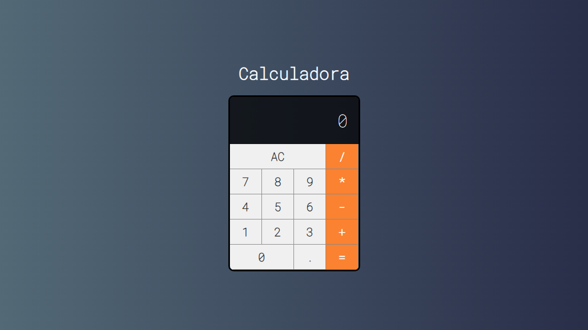

# 🚀 Bem-vindo(a) ao Universo React! ⚛️



Este projeto foi gerado com todo o poder do Create React App (CRA), a ferramenta perfeita para você iniciar sua jornada no React. Prepare-se para criar interfaces incríveis e aplicações web de alto desempenho!

## ✨ Sobre o Projeto

Este é um projeto calculadora em  React⚛️  que permite realizar operações aritméticas básicas. Utiliza useState para gerenciar o estado e useCallback para otimizar o desempenho. Inclui funcionalidades como adição de dígitos, seleção de operações, limpeza do display e tratamento de erros, exibindo "Erro" em operações inválidas.

Este README fornece informações essenciais para você configurar, executar e contribuir com este projeto.

## 🕹️ Scripts Disponíveis

Dentro do diretório do seu projeto, você pode usar os seguintes comandos mágicos:

### `npm start`

✨ Dê vida à sua aplicação! Este comando inicia o servidor de desenvolvimento e abre o seu projeto no navegador, no endereço [http://localhost:3000](http://localhost:3000).

As mudanças que você fizer no código serão recarregadas automaticamente na sua tela (hot-reloading).

Fique de olho no console, ele pode te dar pistas importantes com avisos e erros.

### `npm test`

🧪 Hora de testar! Este comando executa o seu conjunto de testes interativamente (Jest + React Testing Library), facilitando a identificação de problemas e garantindo a qualidade do seu código.

Quer saber mais sobre testes? A [documentação do Jest](https://jestjs.io/docs/getting-started) e da [React Testing Library](https://testing-library.com/docs/react-testing-library/intro/) são suas amigas!

### `npm run build`

📦 Prepare sua obra-prima para o mundo! Este comando cria uma versão otimizada do seu projeto para produção, colocando tudo dentro da pasta `build`.

Ele junta todo o código React de forma eficiente, minifica arquivos (CSS, JavaScript) e otimiza imagens, deixando tudo pronto para um desempenho incrível.

Seu aplicativo está pronto para ser lançado! Consulte a seção [Deploy](#-deploy) para mais informações.

### `npm run eject`

🚨 Atenção: Caminho sem volta! Use este comando com sabedoria, pois ele é uma operação única e irreversível.

Se você quer ter controle total sobre a configuração da sua aplicação (Webpack, Babel, ESLint, etc.), `eject` é o seu aliado.

Ele copia todos os arquivos de configuração do `create-react-app` para o seu projeto, permitindo que você personalize tudo.

**Depois de `eject`, você assume o controle total, e não há como voltar atrás!** Atualizações futuras do `create-react-app` não serão aplicadas automaticamente.

Para a maioria dos projetos, a configuração padrão do Create React App já é ótima. Use com moderação e apenas se você realmente precisar personalizar a configuração.

## 🛠️ Configuração Adicional (Opcional)

[Adicione aqui se o seu projeto requer alguma configuração extra. Por exemplo: variáveis de ambiente, chaves de API, configuração de banco de dados, etc.]

Exemplo:

*   **Variáveis de Ambiente:**
    Crie um arquivo `.env` na raiz do projeto e adicione as seguintes variáveis:

    ```
    REACT_APP_API_KEY=sua_chave_api
    REACT_APP_API_URL=https://api.exemplo.com
    ```

    Lembre-se de reiniciar o servidor de desenvolvimento (`npm start`) após modificar o arquivo `.env`.

## 💻 Código Aberto

Quer saber como a Calculadora foi construída? Confira o código-fonte no nosso repositório:

[Repositório da Calculadora](https://github.com/Domisnnet/calculadora-em-React)    

## 🤝 Contribuição:

1.  Faça um fork do repositório.
2.  Crie uma branch com a sua feature: `git checkout -b minha-nova-feature`
3.  Faça commit das suas mudanças: `git commit -m 'Adiciona uma nova feature'`
4.  Faça push para a sua branch: `git push origin minha-nova-feature`
5.  Abra um Pull Request.

## 📚 Mergulhe Mais Fundo

Quer se tornar um mestre no React? Explore estes recursos:

*   [Documentação do Create React App](https://create-react-app.dev/docs/getting-started)
*   [Documentação do React](https://reactjs.org/docs/getting-started.html)
*   [Código Splitting](https://reactjs.org/docs/code-splitting.html)
*   [Analisando o Tamanho do Pacote](https://create-react-app.dev/docs/analyzing-the-bundle-size/)
*   [Making a Progressive Web App](https://create-react-app.dev/docs/making-a-progressive-web-app/)
*   [Configurações Avançadas](https://create-react-app.dev/docs/advanced-configuration/)
*   [Deploy](https://create-react-app.dev/docs/deployment/)
*   [Solução para Problemas com Build](https://create-react-app.dev/docs/troubleshooting/)

## 🐛 Encontrou um Bug?

Se você encontrar um bug ou tiver alguma sugestão, por favor, abra uma [Issue](https://github.com/Domisnnet/calculadora-em-React/issues) neste repositório.

## 📝 Licença:

Este projeto está licenciado sob a [MIT License](LICENSE).

---

Feito com ❤️ por:

<a href="https://github.com/Domisnnet">
    
    DomisDev
</a>